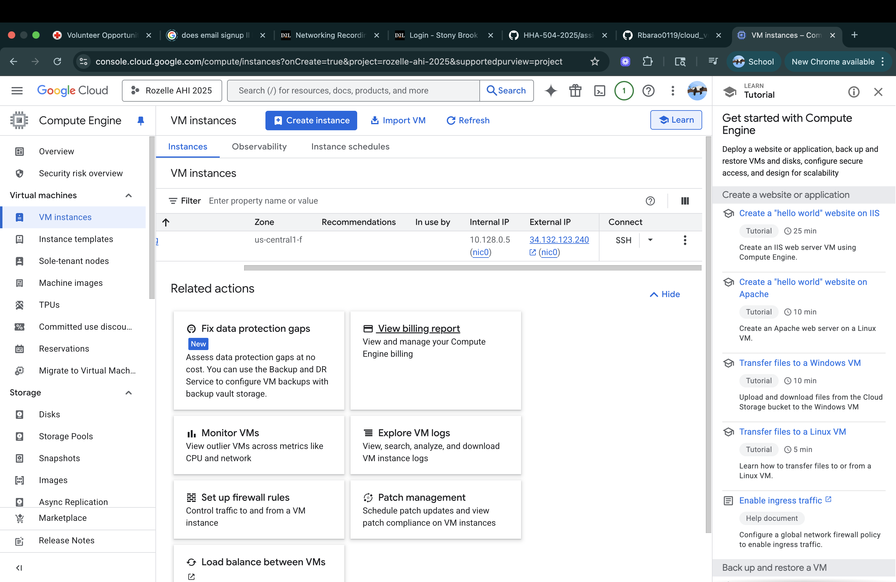
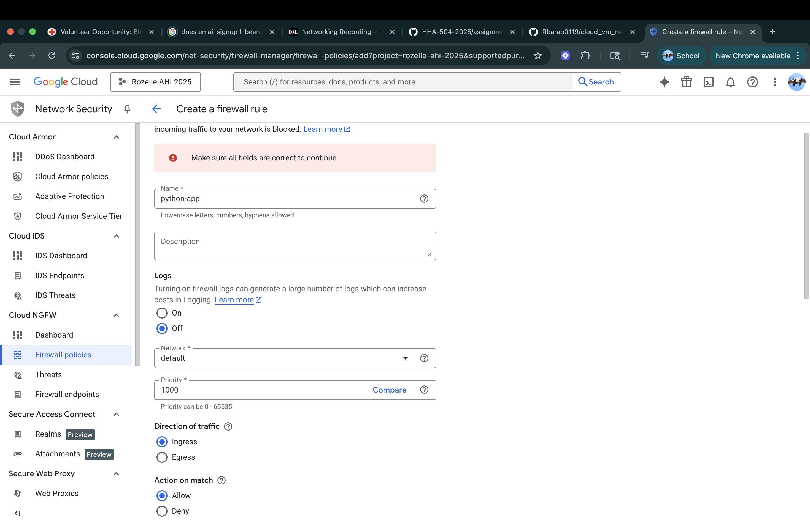
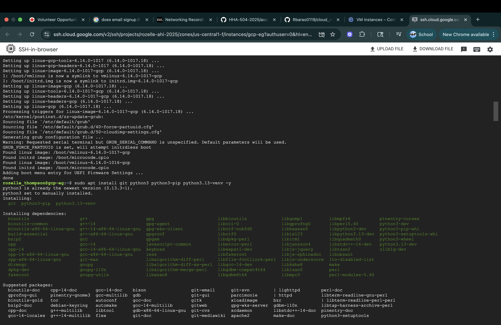
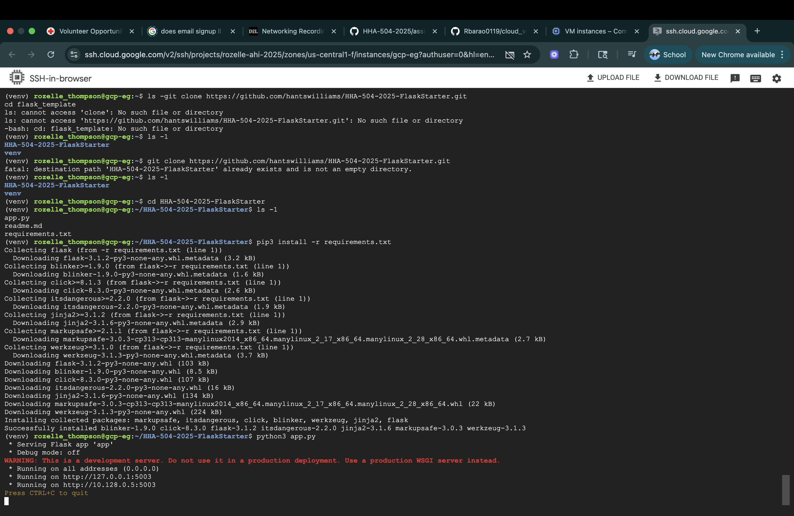
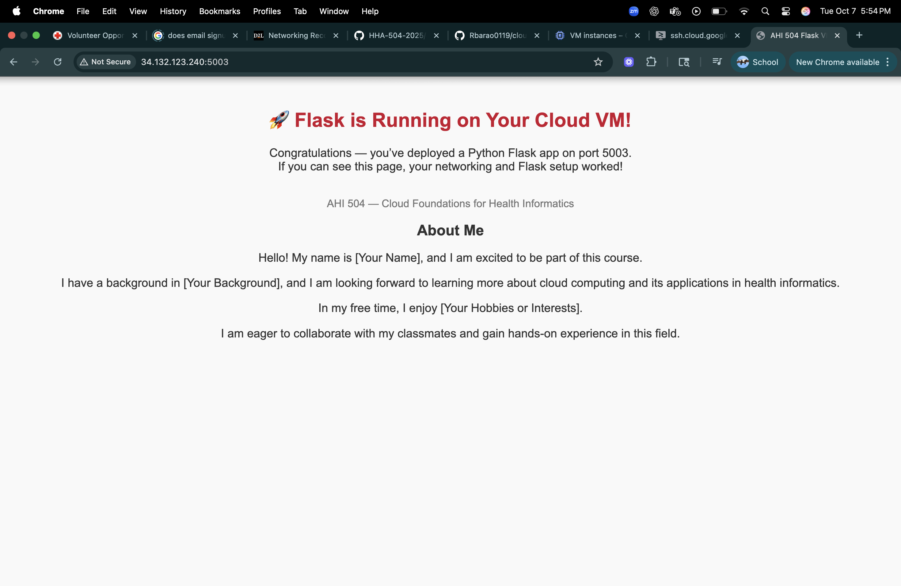

# cloud_vm_networking_flask
### Rozelle Barao Thompson
### Cloud provider: GCP

### Video Recording 
- insert link 

## Steps

### 1. VM Creation

### 2. Networking (Port 5003 Open) 

### 3. OS Update + Python Install 

### 4. Flask App Running 

### 5. Public IP Access
- URL: 

